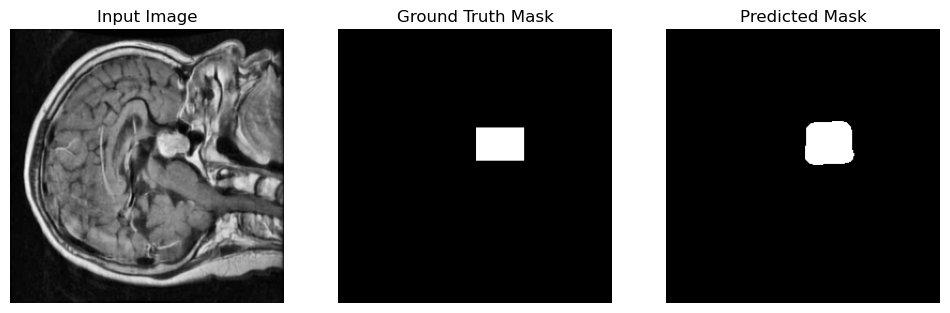

# Brain Tumor Segmentation using U-Net

This repository contains a deep learning project for semantic segmentation of brain tumors from medical imaging data. The model is built using the U-Net architecture with PyTorch to identify and create pixel-wise masks of tumor regions in brain scans.

## Project Overview

Semantic segmentation is a computer vision task that involves classifying each pixel in an image into a specific class. In this project, the goal is to segment brain tumors, which means we are creating a binary mask that highlights the exact location and shape of a tumor within a given brain scan.

The model architecture used is the U-Net, which is particularly well-suited for biomedical image segmentation tasks due to its ability to capture both context and precise location from the images.

## Dataset

The model was trained on a dataset of brain MRI scans containing images with and without tumors. The dataset is structured to provide both the raw images and their corresponding ground-truth segmentation masks, which are used to train and evaluate the model.

## Methodology

The project workflow is as follows:

1.  **Data Preprocessing**: Images and masks are loaded and preprocessed. Data augmentation techniques from the `Albumentations` library, such as horizontal flips, are applied to the training set to improve model robustness.
2.  **Model Architecture**: A U-Net model is implemented from scratch using PyTorch. The U-Net consists of an encoder (downsampling path) to capture context and a decoder (upsampling path) with skip connections to enable precise localization.
3.  **Training**: The model is trained using a combination of Binary Cross-Entropy (BCE) loss and Dice loss. This hybrid loss function helps in handling class imbalance and optimizing for pixel-wise accuracy as well as the overlap between the predicted mask and the ground truth. The Adam optimizer is used to update the model weights.
4.  **Evaluation**: The model's performance is evaluated using the Dice Coefficient (also known as the F1 score), which is a standard metric for comparing the pixel-wise agreement between a predicted segmentation and its corresponding ground truth.

## Technologies and Libraries Used

* **Python**
* **PyTorch**: For building and training the U-Net model.
* **Albumentations**: For data augmentation.
* **NumPy**: For numerical operations.
* **OpenCV (cv2)**: For image processing.
* **Matplotlib**: For visualizing images and results.

## How to Use

To run this project on your own machine, follow these steps:

1.  **Clone the repository:**
    ```bash
    git clone [https://github.com/your-username/your-repository-name.git](https://github.com/your-username/your-repository-name.git)
    ```
2.  **Install the dependencies:**
    ```bash
    pip install torch torchvision albumentations numpy opencv-python matplotlib
    ```
3.  **Run the Jupyter Notebook:**
    Open and run the `semantic_segmentation.ipynb` notebook in a Jupyter environment. Make sure to adjust the dataset paths if necessary.

## Results

The trained U-Net model successfully learned to segment brain tumors from the test images. The final model achieved a **Test Dice Score of 0.7046**, indicating a good overlap between the predicted masks and the ground-truth masks on unseen data.

Below is an example of the model's output on a test image, showing the original image, the ground truth mask, and the mask predicted by the model.



The results demonstrate the model's ability to generalize to new data and accurately identify tumor regions, although there are cases where it may miss a tumor or identify a false positive, highlighting areas for future improvement.

## License

This project is licensed under the MIT License. See the `LICENSE` file for more details.
